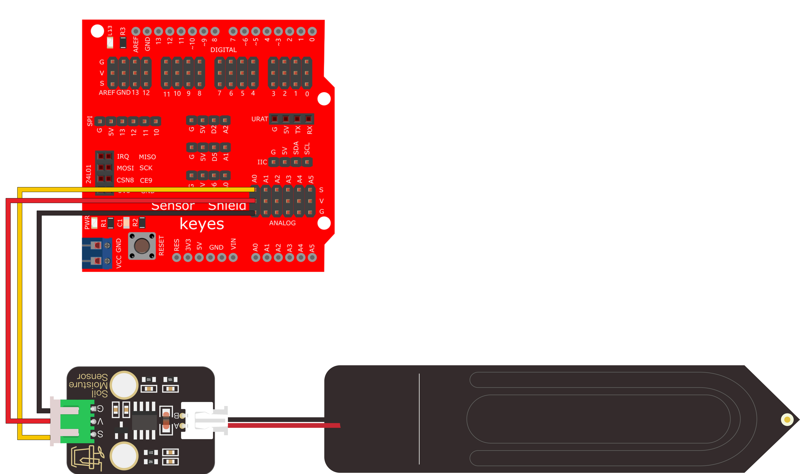
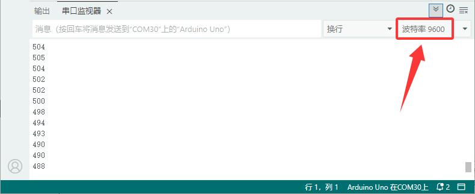

# Arduino

## 1.Arduino简介

Arduino是一个开源电子原型平台，旨在简化电子项目的开发和编程。它由硬件和软件两部分组成，硬件包含各种兼容的开发板，软件则是Arduino IDE，允许用户编写、编辑和上传代码到Arduino板上。Arduino支持多种编程语言，尤其是C/C++，为用户提供丰富的库和示例，使初学者能够轻松入门，同时也能满足专业开发者的需求。Arduino广泛应用于各种项目，包括自动化控制、机器人、艺术装置等，适合教育、科研和自学。

## 2.连接图

| 模块脚 | 开发板脚 |
| :----: | :------: |
|   G    |   GND    |
|   V    |    5V    |
|   S    |    A0    |




## 3.代码

```c
void setup() {
 
 Serial.begin(9600); //设置波特率为9600
 
}
 
void loop() {
 
 int val;//定义整型变量 val
 
 val = analogRead(A0); //将土壤湿度传感器(A0)读取的模拟值赋给于变量 val
 
 Serial.println(val); //串口换行打印土壤湿度传感器读取的模拟值
 
 delay(500);//延时0.5s
 
}
```

## 4.测试结果

上传测试代码至控制板后，利用USB线上电，打开串口监视器，将波特率根据程序设置为`9600`。然后拿一杯水，把该传感器插入水中一定深度（一定不能超过该传感器模块上的白色警戒线）


白色警戒线为你将要插入泥土的深度，并记录此时读到的模拟值，代表100%湿度，（输出数据与湿度成反比，在水中的模拟输出值最小，即：湿度与读数是成反比的。）

