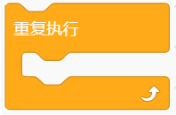
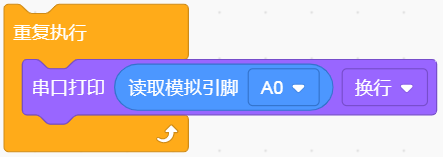
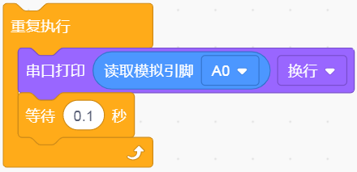
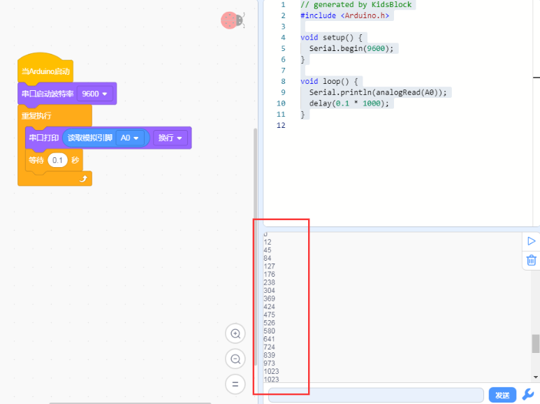

# KidsBlock

## 1.KidsBlock简介

KidsBlock是一款面向儿童和初学者的图形化编程工具，旨在让编程变得简单和有趣。通过采用积木式的拖拽界面，用户可以轻松构建程序，而无需编写复杂的代码。KidsBlock支持与Arduino等硬件平台的集成，使用户能够开发各种电子项目，如机器人、传感器应用等。该工具不仅具备便捷的编程环境，还提供丰富的模块和支持，帮助学习者探索编程的乐趣和创造力，适合教育、娱乐和个人学习使用。

## 2.连接图

| 模块脚 | 开发板脚 |
| :----: | :------: |
|   G    |   GND    |
|   V    |    5V    |
|   S    |    A0    |

## 3.代码

1.在事件里拖出Arduino启动模块。

2.在串口栏拖出设置串口波特率模块并设置波特率为9600。

3.在控制栏拖出重复执行模块。

4.在串口栏拖出串口打印模块；在引脚栏拖出读取模拟引脚模块设置引脚为A0并添加到串口打印模块上。

5.在控制栏拖出延时模块并设置延时为100ms。

## 4.测试结果

上传测试代码至控制板后，利用USB线上电，打开串口监视器，将波特率根据程序设置为`9600`。然后拿一杯水，把该传感器插入水中一定深度（一定不能超过该传感器模块上的白色警戒线）

白色警戒线为你将要插入泥土的深度，并记录此时读到的模拟值，代表100%湿度，（输出数据与湿度成反比，在水中的模拟输出值最小，即：湿度与读数是成反比的。）

