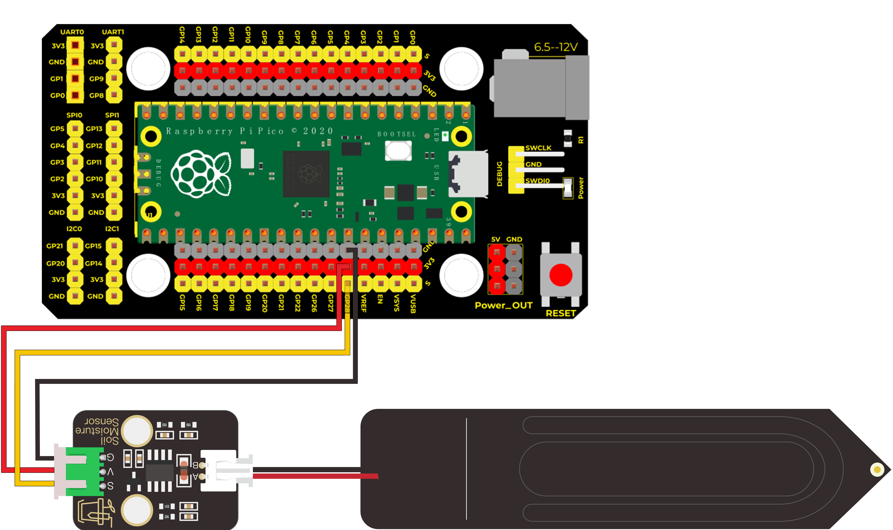
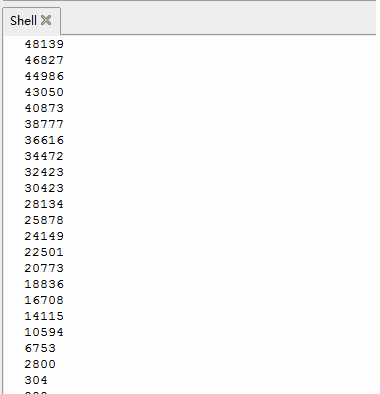

# MicroPython

## 1.MicroPython简介

Python是一种广泛使用的高级编程语言，以其清晰的语法和可读性而著称。自1991年首次发布以来，Python已成为数据分析、人工智能、Web开发、科学计算等领域的主流语言。Python支持多种编程范式，包括面向对象和函数式编程，拥有丰富的第三方库和框架，使得开发者能够高效地构建应用程序。其简单的学习曲线使得Python非常适合初学者，同时其强大的功能也满足了经验丰富的开发者的需求。

## 2.连接图

| 模块脚 | 开发板脚 |
| :----: | :------: |
|   G    |   GND    |
|   V    |   3.3V   |
|   S    |   GP28   |



## 3.代码

```python
import machine  
import utime  

analogPin = machine.ADC(28)  # 设置28脚为模拟信号  

while True:  
    reading = analogPin.read_u16()  # 读取模拟信号  
    print(reading)  # 打印模拟值  
    utime.sleep_ms(100)  # 延迟100毫秒  
```

## 4.测试结果

上传测试代码至控制板后，利用USB线上电，打开串口监视器，将波特率根据程序设置为`9600`。然后拿一杯水，把该传感器插入水中一定深度（一定不能超过该传感器模块上的白色警戒线）


白色警戒线为你将要插入泥土的深度，并记录此时读到的模拟值，代表100%湿度，（输出数据与湿度成反比，在水中的模拟输出值最小，即：湿度与读数是成反比的。）

