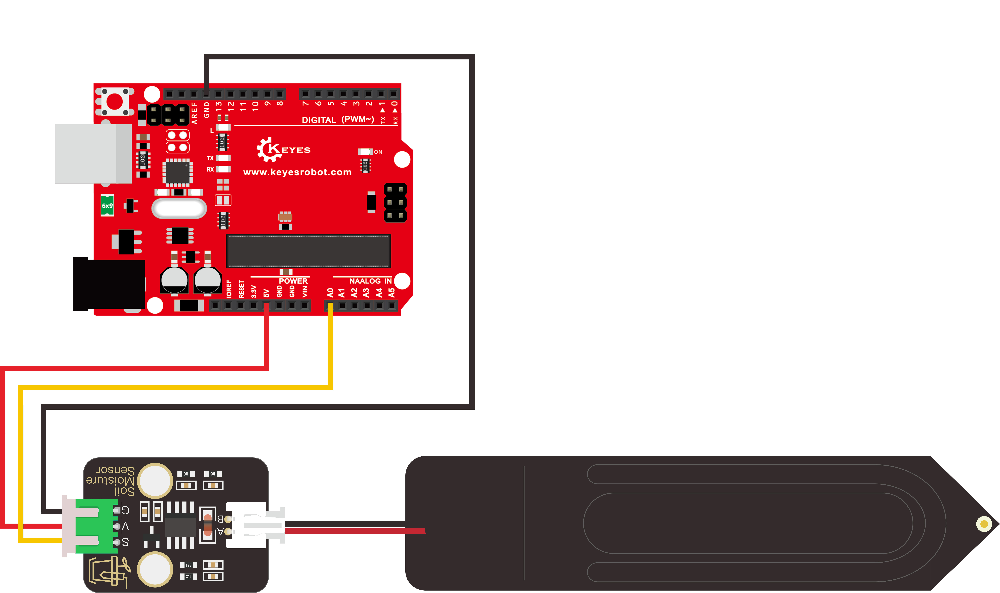
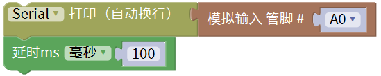
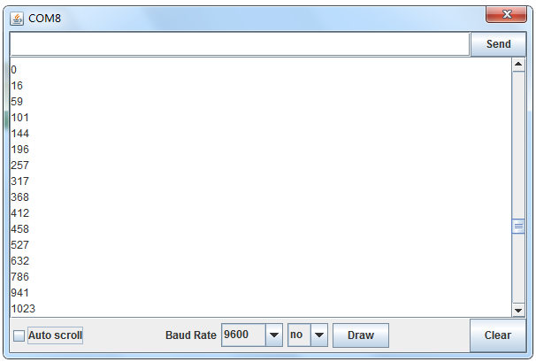

# Mixly

## 1.Mixly简介

Mixly是一款图形化编程工具，专为初学者和儿童设计，旨在使编程变得简单、有趣。它采用积木式的拖放界面，用户可以通过组合不同的模块来创建程序，而无需编写复杂的代码。Mixly支持与多种硬件平台的接入，特别是与Arduino的结合，使得用户可以轻松进行电子项目的开发。该工具具备丰富的功能模块，适合于教育、娱乐和自学的场景，能够有效激发学习者的创造力和编程兴趣。

## 2.连接图

| 模块脚 | 开发板脚 |
| :----: | :------: |
|   G    |   GND    |
|   V    |    5V    |
|   S    |    A0    |

## 3.代码

## 4.测试结果

上传测试代码至控制板后，利用USB线上电，打开串口监视器，将波特率根据程序设置为`9600`。然后拿一杯水，把该传感器插入水中一定深度（一定不能超过该传感器模块上的白色警戒线）

白色警戒线为你将要插入泥土的深度，并记录此时读到的模拟值，代表100%湿度，（输出数据与湿度成反比，在水中的模拟输出值最小，即：湿度与读数是成反比的。）

