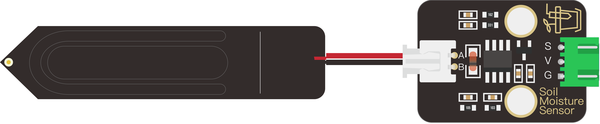
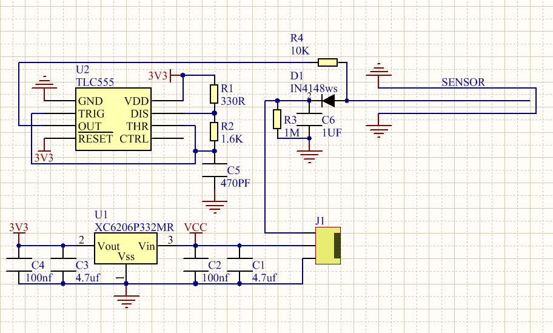

# KE4090 Keyes 新款 DIY电子积木 新型电容式土壤湿度传感器

## 1.实物图

## 2.描述

  新型电容式土壤湿度传感器与其它电阻式传感器的不同，采用了电容感应原理来检测土壤湿度。传感器分为信号端和检测端，使用时检测端插入土壤中，信号端输出模拟值，分段式设计导线连接的方式，搭配套管增强了传感器的防水性能。而检测端由于电路不裸露，不直接接触潮湿的土壤，解决了电阻式传感器容易被腐蚀的问题，相比之下工作寿命更长。信号端内置稳压芯片，支持3.3~5.5V宽电压工作环境，在Arduino、ESP32、micro:bit、掌控板等平台上都可以直接使用，树莓派之类的微型PC，需要外接一个ADC（模拟信号转数字信号）模块就可以工作。

## 3.产品参数

- 控制芯片：TLC555

- 通信接口：输出模拟值

- 额定电压：3.3 ~ 5.5 VDC

- 输出电压：0 ~ 3.0 VDC

- 工作电流：<5mA

- 产品尺寸：信号端：31.6mmx23.7mm / 检测端：23.8mm*83mm

- 工作温度范围：1°C ~ 50°C

## 4.原理图

​	下图为产品原理图

​	

## 5.脚位描述

| 功能引脚 | 描述                  |
| :------: | :-------------------- |
|    G     | 电源负极连接脚        |
|    V     | 3.3V/5V电源正极连接脚 |
|    S     | 模拟数据输出脚        |

